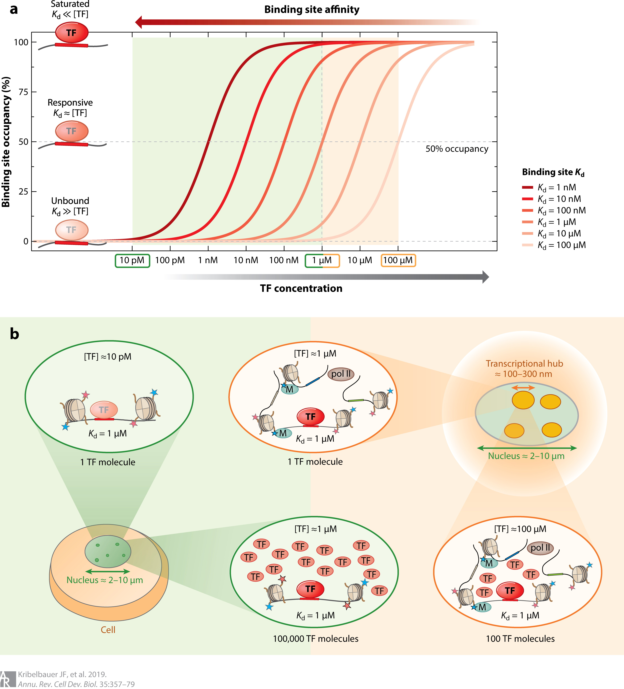

##### Download:

- [Paper](https://doi.org/10.1146/annurev-cellbio-100617-062719)
<!-- - [Code and data](https://github.com/jukri) -->

---

##### Abstract:

Eukaryotic transcription factors (TFs) from the same structural family tend to bind similar DNA sequences, despite the ability of these TFs to execute distinct functions in vivo. The cell partly resolves this specificity paradox through combinatorial strategies and the use of low-affinity binding sites, which are better able to distinguish between similar TFs. However, because these sites have low affinity, it is challenging to understand how TFs recognize them in vivo. Here, we summarize recent findings and technological advancements that allow for the quantification and mechanistic interpretation of TF recognition across a wide range of affinities. We propose a model that integrates insights from the fields of genetics and cell biology to provide further conceptual understanding of TF binding specificity. We argue that in eukaryotes, target specificity is driven by an inhomogeneous 3D nuclear distribution of TFs and by variation in DNA binding affinity such that locally elevated TF concentration allows low-affinity binding sites to be functional.

---

##### Figure 3: Transcription factor (TF) occupancy is a function of both binding site affinity and TF concentration. (a) TF binding to a specific site depends on both the free TF concentration ([TF]free) and the Kd (the inverse of affinity) of the binding site. TF occupancy as a function of free TF concentration is shown for six different binding site affinities (with Kd from 1 nM to 100 μM). Depending on the concentration and Kd, TFs are either unbound ([TF]free ≪ Kd) in a responsive regime, where occupancy varies with concentration ([TF]free ∼ Kd), or saturated ([TF]free ≫ Kd). (b) The influence of nuclear compartment size on TF concentration and on the ability of sites of different affinity to be bound by the TF. Three different concentration regimes (low, intermediate, and high) are highlighted. On the low-concentration end, having only a single TF molecule inside a nucleus with a diameter of 2–10 μm (green) yields [TF]total ∼ 10 pM, which represents an upper bound on [TF]free. At such a low concentration, a weak binding site (Kd ∼ 1 μM) would essentially be unbound; to achieve significant occupancy, 100,000 TF molecules would be required, resulting in a nuclear concentration of ∼1 μM, similar to the Kd. Eukaryotic nuclear architecture brings groups of regulatory elements into proximity in 3D, forming transcriptional hubs of ∼100 nm in diameter (orange). Restricting a single TF molecule to a subnuclear compartment of this size also corresponds to a TF concentration of 1 μM. Recruiting a larger number of free TF molecules to the hub would allow even ultralow-affinity sites with Kds of up to 100 μM to be occupied, while saturation would no longer be limited to just the near-optimal sites (Kd ∼ 10 nM).


---

##### Citation

Kribelbauer, J. F., Rastogi, C., Bussemaker, H. J., & Mann, R. S. (2019). Low-affinity binding sites and the transcription factor specificity paradox in eukaryotes. Annual review of cell and developmental biology, 35, 357-379.

```BibTeX
@article{kribelbauer2019low,
  title={Low-affinity binding sites and the transcription factor specificity paradox in eukaryotes},
  author={Kribelbauer, Judith F and Rastogi, Chaitanya and Bussemaker, Harmen J and Mann, Richard S},
  journal={Annual review of cell and developmental biology},
  volume={35},
  pages={357--379},
  year={2019},
  publisher={Annual Reviews}
}
}
```

<!-- ---

##### Related material

+ [Presentation slides](/presentation.pdf) -->